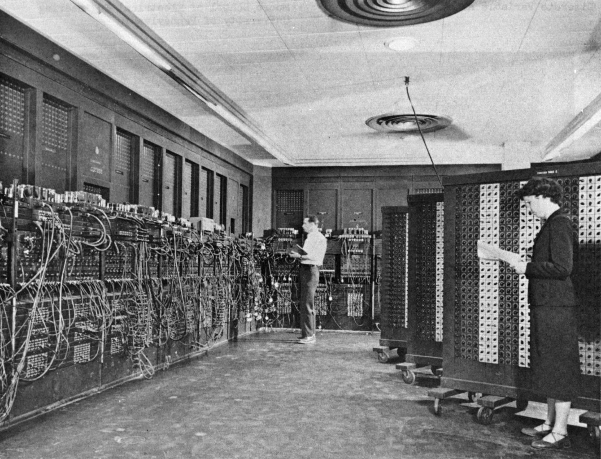
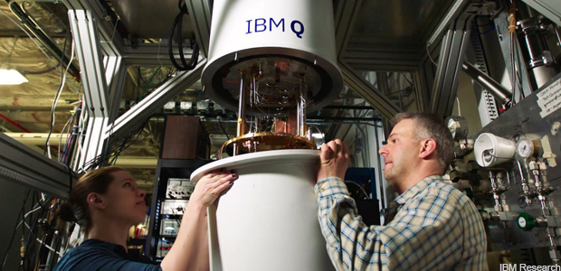

# History repeating itself

In the late 1940s, computers filled rooms, had limited amounts of memory \(bits\), and instruction sets for programming them were very unique. 

It’s very interesting and exciting that history is repeating itself! In the late 2010s, radically new kinds of computers known as quantum computers are being built that fill rooms, have limited amounts of quantum bits \(qubits\), and their instruction sets are certainly unique.

Quantum computers have the potential to solve problems that can’t be solved with classical computers alone. This is a key point about near term quantum processors: They aren’t powerful enough to solve the really hard problems \(e.g. breaking RSA encryption with [Shor’s algorithm](https://en.wikipedia.org/wiki/Shor%27s_algorithm)\) yet, but there are hybrid quantum/classical algorithms that will solve very hard problems in the near future. These problems include the areas of optimization, machine learning, finance, and modeling nature itself. Developers that are fluent in both classical and quantum programming will be in a great position to develop applications that implement these algorithms.

Please take some time to learn more about quantum computing by exploring the [What is quantum computing page](https://www.research.ibm.com/ibm-q/learn/what-is-quantum-computing/) on the IBM Q website.



When you're ready to get started developing programs for quantum computers, select the **Next** button at the bottom of this page.

