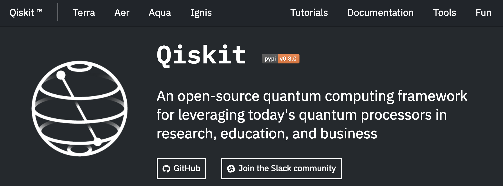

# Getting started with Qiskit

Qiskit is an open-source quantum computing framework for leveraging today's quantum processors in research, education, and business.

Qiskit is short for Quantum Information Science Kit, and its home is the [Qiskit.org](https://qiskit.org/) website. Take a few minutes and explore this website, and be sure to visit the links at the top of the page such as [Terra](https://qiskit.org/terra), [Aqua](https://qiskit.org/aqua), and [Fun](https://qiskit.org/fun).



