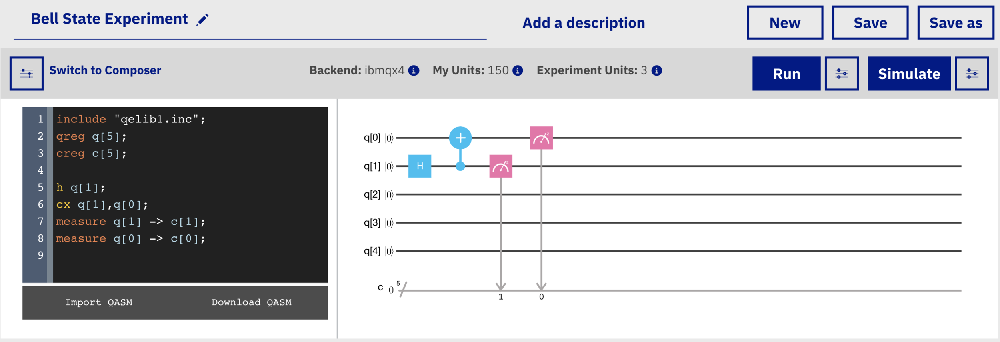

# Learning with IBM Q Composer

One option for experimenting with quantum computing is to use the [IBM Q Composer](https://quantumexperience.ng.bluemix.net/qx/editor). With the Composer you can create quantum circuits and run them on an IBM Q quantum simulator or on a real IBM Q quantum computer.

As shown in the preceding figure, quantum programs are developed with the IBM Q Composer by dragging [quantum logic gates](https://en.wikipedia.org/wiki/Quantum_logic_gate), like the _**H**_ gate, onto the _score_ \(the horizontal lines\). If this style of programming to get started with quantum computing appeals to you, visit the [IBM Q Composer Guide](https://learnqiskit.gitbook.io/composerguide/). If you'd rather begin by writing Python code with a quantum computing framework \(named Qiskit\), then select the **Next** button below and let's dig in!

