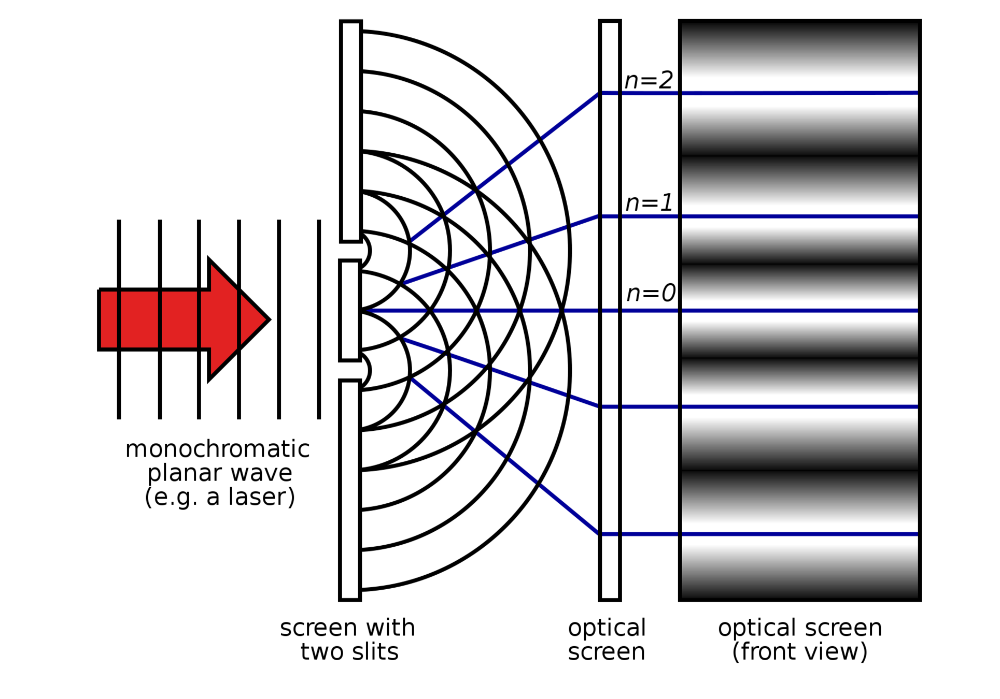
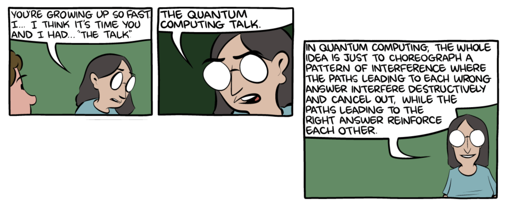

# Understanding basic quantum algorithms

Now that you have a solid foundation in quantum computing, let's dive into some algorithms. We'll start with basic algorithms that aren't very useful for real-world problems, but that demonstrate speedup advantages of quantum computing. The speedup for these algorithms lies in the wave nature of quantum mechanics, in that we can choreograph the interference patterns of waves to increase the probability that the correct answer will appear. This wave nature may be easily demonstrated in the double-slit experiment, where light waves form an interference pattern, as shown in the following illustration:

Take a look at the following article to learn more about this experiment.



This [cartoon by Scott Aaronson and Zach Weinersmith](https://www.scottaaronson.com/blog/?p=3058), from which the following excerpts are highlighted, illustrates the idea of leveraging waves in quantum algorithms in a humorous but enlightening manner. 

  

