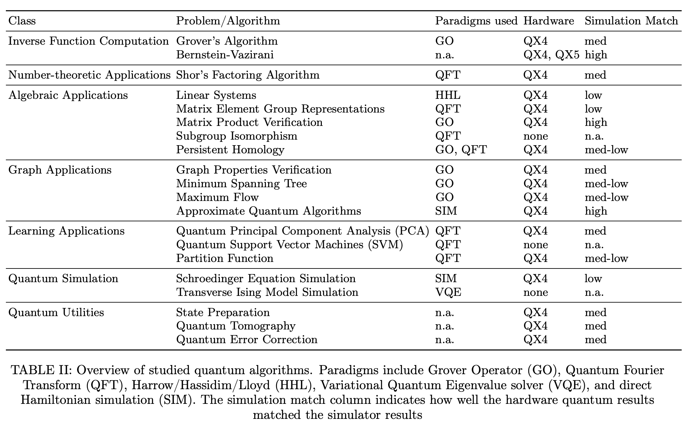

# Quantum algorithmic paradigms

Quantum algorithms leverage some common building blocks, such as the _Quantum Fourier Transform \(QFT\)_, and _Grover's Operator \(GO\)_. These are referred to as _quantum algorithmic paradigms_ in an excellent paper on basic quantum algorithms entitled [Quantum Algorithm Implementations for Beginners](https://arxiv.org/abs/1804.03719). These paradigms, referred to in the following table from this paper, characterize and enable the quantum algorithms in which they are leveraged. 

Take a few minutes to peruse the paper, noting how these algorithms have been implemented on IBM quantum computers.



Let's take a look at some common quantum algorithmic paradigms before examining some of the fundamental quantum computing algorithms.

