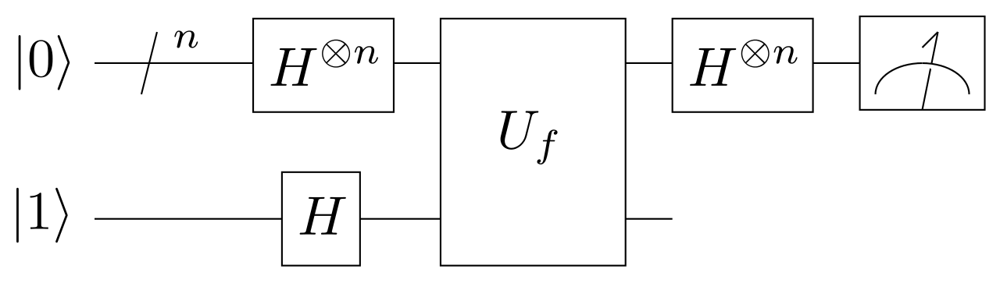

# Deutsch-Jozsa algorithm

The [Deutsch-Jozsa algorithm](https://en.wikipedia.org/wiki/Deutsch%E2%80%93Jozsa_algorithm), published in 1992, is a multi-qubit generalization of Deutsch's algorithm that demonstrates an exponential speedup over classical algorithms. This speedup is achieved by the ability to find the answer to a problem that classically takes $$2^n$$queries, where $$n$$ is the number of qubits in the oracle, **in just one query**. Like its predecessor, the problem is to determine if a function is constant or balanced. Here is an table of results when querying an example oracle consisting of three qubits:

| Input | Constant | Constant | Balanced | Balanced |
| :--- | :--- | :--- | :--- | :--- |
| 000 | 0 | 1 | 0 | 1 |
| 001 | 0 | 1 | 1 | 0 |
| 010 | 0 | 1 | 0 | 1 |
| 011 | 0 | 1 | 1 | 0 |
| 100 | 0 | 1 | 0 | 1 |
| 101 | 0 | 1 | 1 | 0 |
| 110 | 0 | 1 | 0 | 1 |
| 111 | 0 | 1 | 1 | 0 |

Here is a drawing of a Deutsch-Jozsa circuit from its [Wikipedia article](https://en.wikipedia.org/wiki/Deutsch–Jozsa_algorithm):

To get a working understanding of this algorithm, experiment with this Deutsch-Jozsa Algorithm notebook in the Qiskit tutorials:



