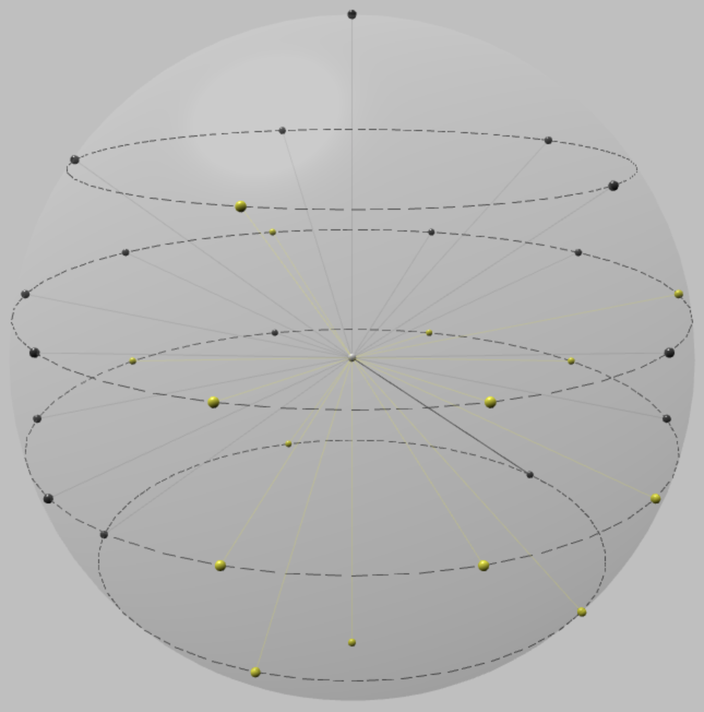

# Understanding quantum states

A quantum state may be represented by one or more qubits. As described earlier, each qubit represents two probability amplitudes. The number of amplitudes in a quantum state grows exponentially with each additional qubit. For example, 5 qubits represents 2^5, or 32 amplitudes. Because each amplitude corresponds to a dimension in a vector space, and we live in a three-dimensional world, it is difficult for humans to visualize quantum states in terms of spacial dimensions. There are, however, tools to visualize quantum states, such as the Q-sphere, shown below.

  

