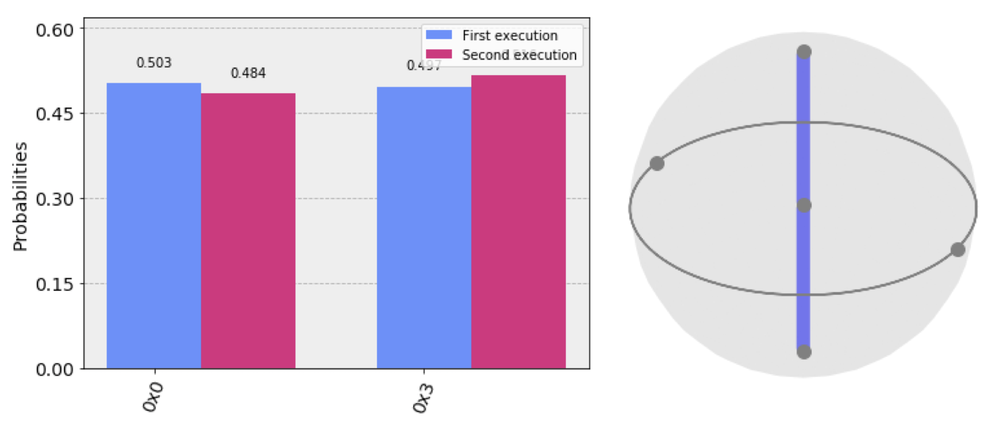

# Plotting quantum states and measurements

When a quantum circuit is executing, the states of individual qubits, as well as the circuit's overall quantum state, evolve. Because a quantum state collapses into a basis state when measured, we can't know with certainty what the quantum state before measurement was in a real quantum device. However, in certain types of quantum simulators such as a state vector simulator, we can access these quantum states. We can also use a technique known as _quantum state tomography_ \(see [Quantum State Tomography](https://github.com/Qiskit/qiskit-tutorial/blob/master/qiskit/ignis/state_tomography.ipynb) notebook in the Qiskit tutorials\) to approximate the pre-measurement quantum state. 

To learn how to plot quantum states and measurement data, experiment with the Plotting Data in Qiskit notebook in the Qiskit tutorials. You can click the box below to access it in GitHub, or [click here to open it in Google Colaboratory](https://colab.research.google.com/github/Qiskit/qiskit-tutorial/blob/master/qiskit/basics/plotting_data_in_qiskit.ipynb).



