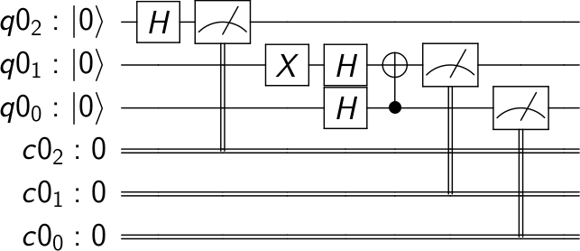

# Visualizing a Quantum Circuit

As you've seen previously, creating quantum programs with Qiskit involves writing code that creates quantum circuits. There are facilities within Qiskit that enable you to visualize your circuits, and you can explore these facilities with this Visualizing a Quantum Circuit notebook in the Qiskit tutorials. You can click the box below to access it in GitHub, or [click here to open it in Google Colaboratory](https://colab.research.google.com/github/Qiskit/qiskit-tutorial/blob/master/qiskit/terra/visualizing_a_quantum_circuit.ipynb).



